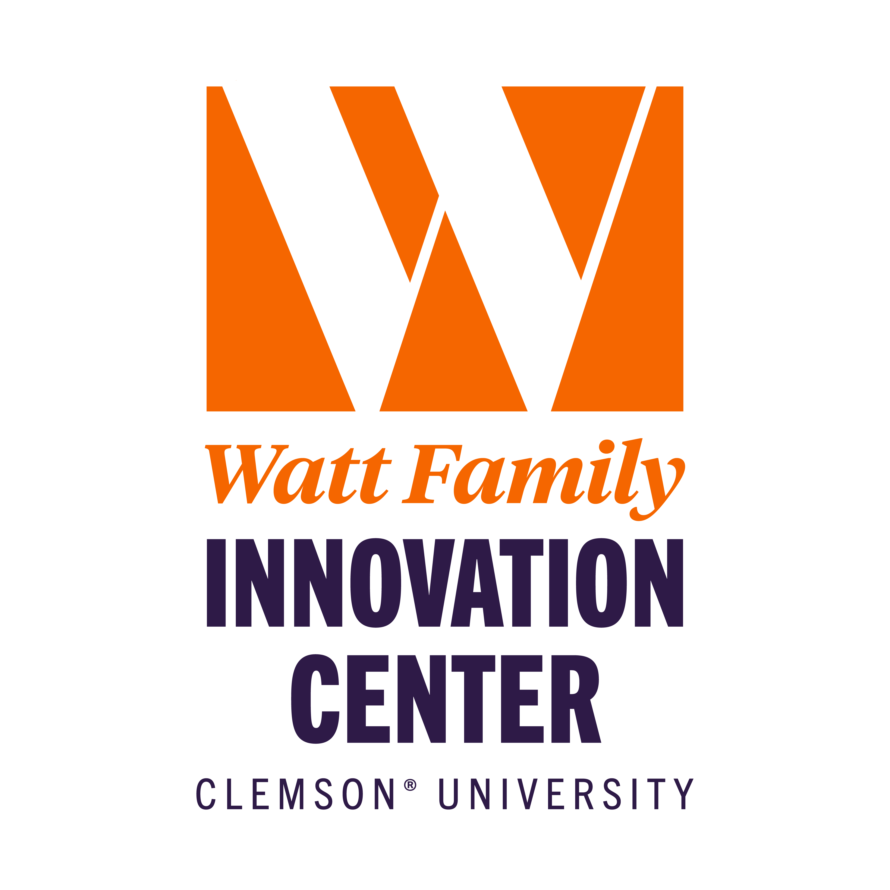

# Watt AI (INNO-4990) — Fall 2026

This public repository contains the student-facing materials for Watt AI
(INNO-4990) at the Watt Family Innovation Center. Each course is standalone:
students may begin with the topic that matches their interests and background.

## Available course

- [LLM Agents and Video Analysis](https://fcmeng.github.io/wattai-returning-students/llm-agents-and-video-analysis/)

The website provides readable HTML lessons, individual notebook downloads,
and a complete course bundle. The complete bundle is the recommended option
for running the notebooks because it includes the relative assets, data, and
helper modules used by the code.

## Semester branch

The materials currently published for students are on the `2026-Fall`
branch. Future offerings may use separate semester branches so that the
version used in a class remains reproducible.

## What is intentionally not included

Instructor notes, answer notebooks, notebook-generation scripts, build tools,
private service credentials, and authoring history are not part of this
student distribution.

## Usage and attribution

These materials are provided for classroom study. Course-original materials
remain copyrighted by their author. Third-party datasets and media retain
their original licenses and attribution; see each course's asset and data
manifests before redistributing them.
